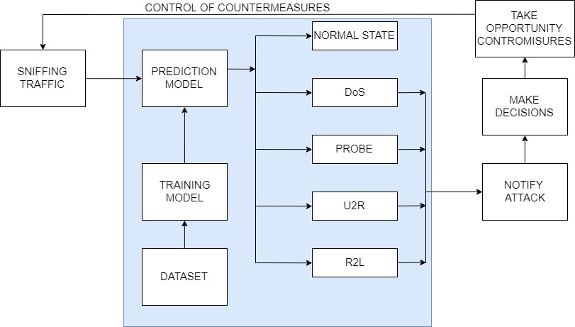

# Anomaly-based Network Intrusion Detection System with R

Anomaly based Network Intrusion Detection System is software application that monitors a network. It is composed by some parts, as shown in figure:


.


1. Sniffing packets that cross the network.
2. Prediction model.
    - Find a dataset.
    - Training model with dataset.
3. Notify attack
4. Making a decision in order to block an attack.

**IMPORTANT** :this project permit to create an a prediction model. It permit to train five differents models.
Thus, this is a simple code that shows as different models can be trained in R.
The models are:

- Support Vector Machine
- Random Forest
- XGBoost
- NeuralNet
- Keras

Furthermore, the compute power available limits models dimensions. In fact, the profiling metrics is not considered.

In the future, I will provide to better models, like Keras model, when a sufficient compute power is aviable for me.

I advide you to try a change a models in order to exploit a model beneficts. Thus, I advice to imporove Keras models in order to obtain a better result. 
**If you obtain better result, I'm really happy to consider and work on new branch or fork**

The code is written in R and uses a [KDD-Cup 1999 dataset](http://kdd.ics.uci.edu/databases/kddcup99/kddcup99.html) and [NSL-KDD dataset](https://github.com/defcom17/NSL_KDD) .

For more information, it is possible to read my [master degree thesis](https://drive.google.com/open?id=1VPBtQhsF4hWB7W0ethwvmocEd5vrYyMQ) or contact me through e-mail at silsniper@gmail.com.
  
## Getting Started

It is possible to clone or download the project.
Remember that the project has the main goal to show how train different models of Machine or Deep Learning.
Thus, it is possible to implement Network Intrusion Detection System \"PREDICTION\" phase.

R language is choosen to reach the goal. Furthermore, it is possible to integrate R model in other programming laguages, as Java. I advise to import, or copy, the project using the RStudio Community IDE.

Homewher, the project uses external resources. They are two dataset: KDD-Cup 1999 and NSL-KDD. They are widely used in academic world.

For futher information, it is possible to read my [master degree thesis](https://drive.google.com/open?id=1VPBtQhsF4hWB7W0ethwvmocEd5vrYyMQ) or contact me through e-mail at \*silsniper@gmail.com\*

### Prerequisites

The libraries are used in project are:

  - caret
  - keras
  - nuerlanet
  - e1071
  - xgboost
  - dplyr

It is important to install previous libraries. Thus, it is possible install library, in R, using the command: 

```
install.packages("caret")
```
The previous command install permits to get the caret library.

For keras, it is necessary to solve different dependencies, as Anaconda. The dependencies vary for different Operating  System used. I advice to follow the istruction that are presented in official Keras site, [available there](https://keras.rstudio.com/).

### Installing

It is only necessary to download or clone project and run its.

Remember to set a working diretctory, running the command:
```
setwd("relativepath")
```
in the R console. Otherwise, you would use a tab panel, in bottom right, in RStudio:
click on More -> Set As Working Directory.

## Running the tests

It is sufficient to click \"Run\" in the Rstudio. Otherwise, it is possible run code in R Console.

### Other infromation

The prpject is divided in four directory:

  - \"adjusting dataset \" : the R scripts permit to prepare the datasets. In fact, it is convenient to add the names of the columns and to group the data of the attacks according to five classes (DoS, Probe, U2R, R2l, normal).
  - \"dataset reduction\" : permit to reduce a dataset dimensions, analyzing the correlation function between features, the importance features with Random Forest and the scaling a values, in order to get a better performance.
  - \"exploratory data analysis\" : permit to get confidence with data. Furthermore, permit to delete some outlier, if presents, using a simple plots. 
  - \"models evaluation\" : contains five different models. It is the core of the project: after having trained a model with KDD and NSL data sets, it is possible to save the model (the created R object) that will represent the prediction block of the Network Intrusion Detection System.. 

## Authors

* **Benedetto Marco Serinelli** - *Developer* - [marksniper](https://github.com/marksniper/)
-[Benedetto Marco Serinelli](https://www.linkedin.com/in/benedetto-marco-serinelli-983228162)

## License

This project is licensed under the MIT License - see the [LICENSE](LICENSE) file for details.
